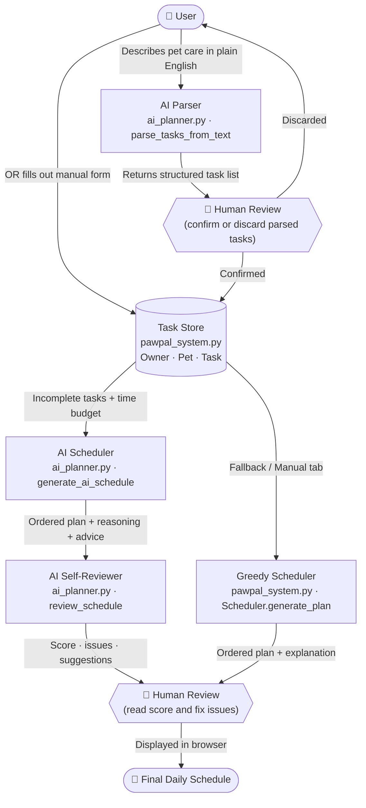
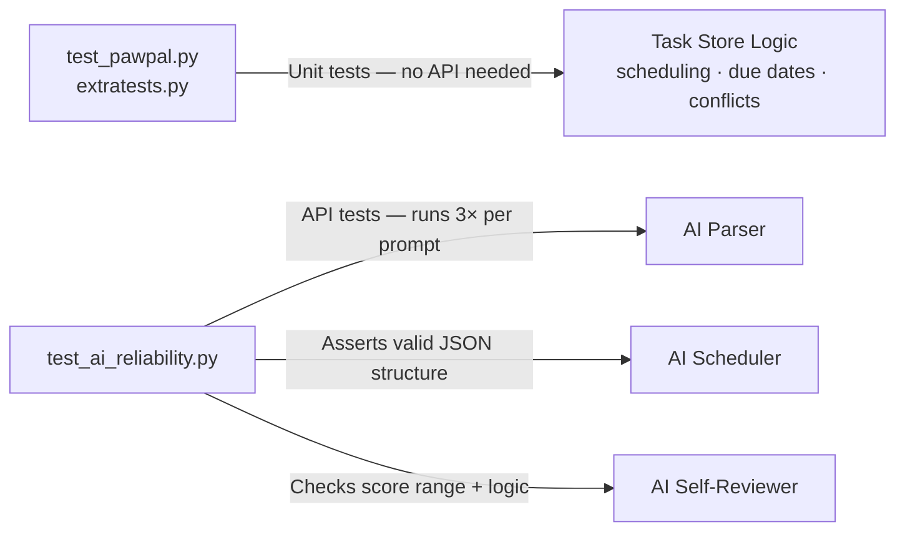

# PawPal+ System Diagram

## Data Flow



---

## Component Breakdown

| Component | File | Role |
|---|---|---|
| **Streamlit UI** | `app.py` | Renders all inputs and outputs in the browser |
| **AI Parser** | `ai_planner.py` | Converts natural language → structured `Task` dicts using Gemini |
| **Task Store** | `pawpal_system.py` | Holds `Owner`, `Pet`, and `Task` objects in memory |
| **AI Scheduler** | `ai_planner.py` | Asks Gemini to order tasks within the time budget, with reasoning |
| **Greedy Scheduler** | `pawpal_system.py` | Deterministic fallback — always schedules high-priority tasks first |
| **AI Self-Reviewer** | `ai_planner.py` | Gemini checks its own schedule and returns a quality score + issues |

---

## Where Humans Are Involved

```
Step 1 — After AI Parser
  User sees a table of parsed tasks and must click "Add All" to confirm.
  They can discard and retype if the AI misunderstood anything.

Step 2 — After AI Self-Reviewer
  User reads the score (1–10), any flagged issues, and suggestions.
  They decide whether to act on the feedback or keep the schedule as-is.
```

---

## Where Testing Is Involved



| Test File | What it checks | API needed? |
|---|---|---|
| `tests/test_pawpal.py` | Core scheduling logic, task completion, conflict detection | No |
| `tests/extratests.py` | Extended edge cases for the data model | No |
| `tests/test_ai_reliability.py` | AI outputs are always valid JSON, logically consistent, and stable across repeated runs | Yes (Gemini free tier) |
